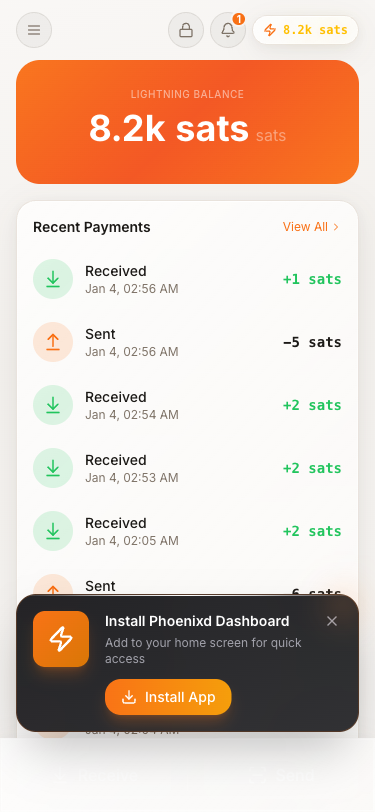
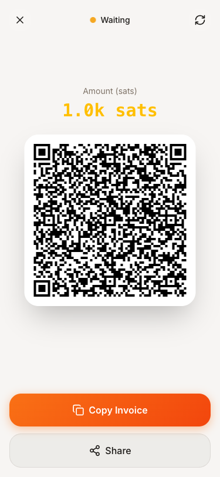

<p align="center">
  
</p>

<h1 align="center">Phoenixd Dashboard</h1>

<p align="center">
  <strong>A modern, self-hosted dashboard for your <a href="https://github.com/ACINQ/phoenixd">phoenixd</a> Lightning node</strong>
</p>

<p align="center">
  <a href="#features">Features</a> •
  <a href="#quick-start">Quick Start</a> •
  <a href="#documentation">Docs</a> •
  <a href="#screenshots">Screenshots</a>
</p>

<p align="center">
  
  
  
  
  
</p>

<br>

<p align="center">

https://github.com/user-attachments/assets/494d58b8-1e23-473e-8aca-74a2705ac33e

</p>

<br>

## Features

✅ **Setup Wizard** — Step-by-step onboarding: profile selection, password, language, and network configuration

✅ **Send & Receive** — Bolt11, Bolt12 offers, Lightning Address, On-chain

✅ **Dashboard** — Real-time balance, channel stats, payment activity charts

✅ **Bitcoin Network** — Live block height, fee estimates, and mempool congestion from mempool.space

✅ **Analytics** — Activity heatmaps, payment distribution, monthly comparisons, fees breakdown, top contacts

✅ **History** — Full payment history with filters & CSV export

✅ **Contacts** — Save Lightning Addresses, Node IDs, and BOLT12 offers with labels for quick payments

✅ **Recurring Payments** — Schedule automatic payments (daily, weekly, monthly) to contacts

✅ **Payment Labels** — Add notes, categories, and tags to organize transactions

✅ **Contact Labels** — Categorize contacts with custom labels and filter by category

✅ **Tools** — Decode invoices, liquidity fees, LNURL support

✅ **Multi-Currency** — Display in 10+ fiat currencies with BIP-177 unit support

✅ **Multi-Node** — Connect to multiple phoenixd instances and switch between them

✅ **Celebration Animations** — Confetti, thunder, fireworks, and more on payments

✅ **Apps** — Built-in Donations page + install custom apps via Docker/GitHub

✅ **PWA** — Install as native app on any device

✅ **Desktop App** — Native macOS/Linux app with system tray

✅ **Remote Access** — Tailscale VPN, Cloudflare Tunnel, or Tor Hidden Service

<br>

## Download

**[📥 Download Latest Release](https://github.com/MiguelMedeiros/phoenixd-dashboard/releases/latest)**

Available for macOS and Linux. See [Desktop App](desktop/README.md) for details.

<br>

## Quick Start

```bash
# Clone the repository
git clone https://github.com/MiguelMedeiros/phoenixd-dashboard
cd phoenixd-dashboard

# Run the setup script
./scripts/setup.sh

# Open in your browser
open http://localhost:3000
```

> **Note:** Requires Docker and Docker Compose. See [Installation](docs/installation.md) for detailed instructions.

<br>

## Documentation

### Getting Started

- 📦 [**Installation**](docs/installation.md) — Docker setup, local development, and requirements
- ☁️ [**Cloud Deploy**](docs/cloud-deploy.md) — One-click deploy to Railway, Render, DigitalOcean, Heroku
- ⚙️ [**Configuration**](docs/configuration.md) — Environment variables, network modes, and options
- 🔌 [**External Phoenixd**](docs/external-phoenixd.md) — Connect to an existing phoenixd instance
- 🖥️ [**Desktop App**](desktop/README.md) — Native app for macOS and Linux

### Mobile & Remote Access

- 📱 [**PWA Installation**](docs/pwa-install.md) — Install on iOS/Android without app stores
- 🔗 [**Tailscale VPN**](docs/mobile-wallet-setup.md) — Private remote access via Tailscale
- ☁️ [**Cloudflare Tunnel**](docs/cloudflare-tunnel.md) — Public access with custom domain
- 🧅 [**Tor Hidden Service**](docs/tor-hidden-service.md) — Anonymous access via .onion address

### Apps & Integrations

- 🧩 [**Apps Development**](docs/apps-development.md) — Create apps that integrate with your node
- 💝 [**Donations App**](apps/donations/README.md) — Accept Lightning donations (example app)

### Security & API

- 💾 [**Backup & Recovery**](docs/backup-recovery.md) — Protect your funds with proper backups
- 🔐 [**Verify Downloads**](docs/verify-downloads.md) — Verify checksums and GPG signatures
- 🔌 [**API Reference**](docs/api.md) — REST endpoints and WebSocket events

<br>

## Screenshots

<details>
<summary><strong>Desktop Dashboard</strong></summary>
<br>
<p align="center">
  
</p>
</details>

<details>
<summary><strong>Receive Payments</strong></summary>
<br>
<p align="center">
  
</p>
</details>

<details>
<summary><strong>Channel Management</strong></summary>
<br>
<p align="center">
  
</p>
</details>

<details>
<summary><strong>Mobile PWA</strong></summary>
<br>
<p align="center">
  
  &nbsp;&nbsp;
  
</p>
</details>

<br>

## Contributing

Contributions are welcome! See [CONTRIBUTING.md](CONTRIBUTING.md) for guidelines.

<br>

## License

This project is licensed under the MIT License — see the [LICENSE](LICENSE) file for details.

<br>

---

<p align="center">
  <strong>⚠️ Disclaimer</strong><br>
  <sub>This software is provided "as is" without warranty. Use at your own risk.<br>
  Always backup your seed phrase and test with small amounts first.<br>
  <strong>Mainnet = Real funds!</strong> ⚡</sub>
</p>
