# ☁️ Cloudflare Tunnel

Expose your Phoenixd Dashboard to the internet securely through **Cloudflare Tunnel** - without opening ports, setting up DNS, or managing certificates.

<p align="center">
  <strong>No port forwarding • Free HTTPS • Custom domain • DDoS protection</strong>
</p>

## Why Use Cloudflare Tunnel?

| Feature | Port Forwarding | Cloudflare Tunnel |
|---------|-----------------|-------------------|
| Requires router config | ✅ Yes | ❌ No |
| HTTPS certificate | Manual setup | ✅ Automatic |
| Custom domain | Requires DNS | ✅ Built-in |
| DDoS protection | ❌ None | ✅ Included |
| IP exposure | ✅ Exposed | ✅ Hidden |
| Works behind CGNAT | ❌ No | ✅ Yes |

**Best for:**
- Public-facing dashboards
- Custom domain access (e.g., `lightning.yourdomain.com`)
- Users behind carrier-grade NAT (CGNAT)
- Fast, reliable remote access

---

## How It Works

```mermaid
flowchart TB
    subgraph server["🏠 Your Server"]
        direction LR
        phoenixd["⚡ Phoenixd<br/>Lightning Node"]
        backend["🔧 Backend<br/>:4000"]
        frontend["🌐 Frontend<br/>:3000"]
        cloudflared["☁️ Cloudflared<br/>Connector"]
        phoenixd --> backend --> frontend
        frontend --> cloudflared
        backend --> cloudflared
    end

    subgraph cf["☁️ Cloudflare Edge"]
        edge["🌍 Global Edge<br/>DDoS Protection<br/>SSL Termination"]
    end

    subgraph user["📱 Browser (Anywhere)"]
        browser["🌐 Any Browser"]
    end

    cloudflared -->|"Outbound Only"| cf
    cf <-->|"HTTPS"| user
    user -->|"lightning.yourdomain.com"| cf

    style server fill:#1a1a2e,stroke:#16213e,color:#fff
    style cf fill:#f48120,stroke:#d97706,color:#000
    style user fill:#1a1a2e,stroke:#16213e,color:#fff
    style phoenixd fill:#f59e0b,stroke:#d97706,color:#000
    style backend fill:#3b82f6,stroke:#2563eb,color:#fff
    style frontend fill:#10b981,stroke:#059669,color:#fff
    style cloudflared fill:#f48120,stroke:#d97706,color:#000
    style edge fill:#f48120,stroke:#d97706,color:#000
    style browser fill:#3b82f6,stroke:#2563eb,color:#fff
```



---

## Prerequisites

Before you begin, you need:

1. **A Cloudflare account** (free) - [Sign up here](https://dash.cloudflare.com/sign-up)
2. **A domain** - Either:
   - Use a domain you own (add it to Cloudflare)
   - Get a free subdomain on a Cloudflare-managed domain

---

## Setup Guide

### 1. Create a Cloudflare Tunnel

1. Log in to [Cloudflare Zero Trust Dashboard](https://one.dash.cloudflare.com/)
2. Go to **Networks** → **Tunnels**
3. Click **"Create a tunnel"**
4. Choose **"Cloudflared"** as the connector type
5. Name your tunnel (e.g., "phoenixd-dashboard")
6. Click **"Save tunnel"**

### 2. Get Your Tunnel Token

After creating the tunnel, Cloudflare shows installation options:

1. Click **"Docker"** tab
2. Copy the token from the command - it looks like:
   ```
   eyJhIjoiNjE2...very-long-string...
   ```
3. **Save this token** - you'll need it in the dashboard

### 3. Configure Public Hostname

Still in Cloudflare:

1. Go to the **"Public Hostname"** tab
2. Click **"Add a public hostname"**
3. Configure for **Frontend**:
   - **Subdomain**: `lightning` (or your choice)
   - **Domain**: Select your domain
   - **Type**: HTTP
   - **URL**: `phoenixd-frontend:3000`
4. Click **"Save hostname"**

5. Add another hostname for **Backend API**:
   - **Subdomain**: `lightning-api` (or your choice)
   - **Domain**: Select your domain
   - **Type**: HTTP
   - **URL**: `phoenixd-backend:4000`
6. Click **"Save hostname"**

### 4. Enable in Dashboard

1. Open your dashboard at `http://localhost:3000`
2. Go to **Settings** page
3. Scroll to **Remote Access** section
4. Find **Cloudflare Tunnel**
5. Paste your tunnel **Token**
6. Click **"Save"**
7. Click **"Enable"**

Wait 30-60 seconds for the tunnel to connect.

### 5. Access Your Dashboard

Once the tunnel is connected (green status), access via:

```
https://lightning.yourdomain.com
```

---

## Features

### ✅ Custom Domain

Use your own domain with professional branding:
- `https://lightning.mybusiness.com`
- `https://wallet.myname.com`
- Any subdomain you choose

### ✅ Automatic HTTPS

Cloudflare handles SSL certificates:
- Free SSL certificate included
- Auto-renewal
- Always secure connection

### ✅ DDoS Protection

Cloudflare's network protects your dashboard:
- Absorbs attack traffic
- Never reaches your server
- Free basic protection included

### ✅ No Port Forwarding

Works even behind:
- Consumer routers
- Carrier-grade NAT (CGNAT)
- Firewalls
- Corporate networks

---

## Security Configuration

### Access Policies (Recommended)

Add authentication before Cloudflare:

1. Go to **Access** → **Applications**
2. Click **"Add an application"**
3. Choose **"Self-hosted"**
4. Configure:
   - **Application name**: Phoenixd Dashboard
   - **Session duration**: 24 hours
   - **Application domain**: `lightning.yourdomain.com`
5. Add a **Policy**:
   - **Policy name**: Allowed Users
   - **Action**: Allow
   - **Include**: Emails ending in `@yourdomain.com`
6. Click **"Save"**

Now users must authenticate with Cloudflare before reaching your dashboard.

### IP Allowlist

Restrict access to specific IPs:

1. Go to **Security** → **WAF**
2. Create a rule to block or challenge unknown IPs
3. Allowlist your known IP addresses

---

## Troubleshooting

### Tunnel Won't Connect

```bash
# Check container status
docker ps -a | grep cloudflared

# View logs
docker logs phoenixd-cloudflared
```

Common issues:
- **Invalid token**: Double-check you copied the entire token
- **Network blocked**: Some networks block Cloudflare (rare)
- **Rate limited**: Wait a few minutes and try again

### 502 Bad Gateway

This means Cloudflare can reach the tunnel, but not your services:

1. Check that frontend and backend are running:
   ```bash
   docker ps | grep phoenixd
   ```
2. Verify hostnames in Cloudflare match Docker service names
3. Check internal network connectivity

### Slow Loading

Unlike direct connections, traffic goes through Cloudflare:
- First load may take 1-3 seconds
- Subsequent loads are faster (cached)
- WebSocket connections may have slight latency

### SSL/Certificate Errors

Cloudflare handles SSL automatically. If you see errors:
1. Go to **SSL/TLS** in Cloudflare dashboard
2. Set encryption mode to **"Flexible"** or **"Full"**
3. Wait 5 minutes for propagation

---

## Best Practices

### 1. Use Access Policies

Don't rely only on dashboard password. Add Cloudflare Access for:
- Email-based authentication
- One-time passwords
- Identity provider integration

### 2. Enable Firewall Rules

Block common attack patterns:
- Rate limiting
- Bot protection
- Country blocking (if applicable)

### 3. Monitor Tunnel Health

Check tunnel status regularly:
1. Cloudflare Dashboard → Networks → Tunnels
2. View connector status
3. Check for error logs

### 4. Keep Token Secure

The tunnel token grants access to your tunnel:
- Never share it publicly
- Rotate if compromised
- Store securely

---

## Comparison: Remote Access Methods

| Feature | Tailscale | Cloudflare Tunnel | Tor Hidden Service |
|---------|-----------|-------------------|-------------------|
| **Speed** | ✅ Fast | ✅ Fast | ⚠️ Slow |
| **Custom domain** | ❌ No | ✅ Yes | ❌ No |
| **Public access** | ❌ Requires app | ✅ Any browser | ⚠️ Tor Browser |
| **Privacy** | ⚠️ Tailscale sees metadata | ⚠️ Cloudflare sees traffic | ✅ Maximum |
| **Setup** | Easy | Medium | Easy |
| **DDoS protection** | ❌ No | ✅ Yes | ✅ Inherent |
| **SSL certificate** | ✅ Automatic | ✅ Automatic | N/A (HTTP) |
| **Cost** | Free tier | Free tier | Free |

**Choose Cloudflare when:**
- You want a custom domain
- You need public browser access
- DDoS protection is important
- You're behind CGNAT

---

## Technical Details

### Docker Container

The cloudflared container is managed automatically:

```yaml
# Managed dynamically by backend
cloudflared:
  image: cloudflare/cloudflared:latest
  command: tunnel --no-autoupdate run --token <YOUR_TOKEN>
  network_mode: phoenixd-dashboard_default
  restart: unless-stopped
```

### Network Architecture

Cloudflared establishes an outbound connection to Cloudflare:
- No inbound ports required
- Uses QUIC/HTTP2 for efficiency
- Maintains persistent connection

### Service Names

When configuring public hostnames, use Docker service names:
- Frontend: `phoenixd-frontend:3000`
- Backend: `phoenixd-backend:4000`

---

## Advanced: Multiple Services

You can expose additional services through the same tunnel:

1. Go to Cloudflare → Networks → Tunnels → Your Tunnel
2. Add more **Public Hostnames**:
   - `api.yourdomain.com` → `phoenixd-backend:4000`
   - `monitoring.yourdomain.com` → `your-monitoring:port`

---

## FAQ

**Q: Is Cloudflare free?**
A: Yes, the free tier includes tunnels, basic DDoS protection, and SSL. Advanced features require paid plans.

**Q: Can I use multiple domains?**
A: Yes, add multiple public hostnames pointing to different domains.

**Q: What if Cloudflare goes down?**
A: You can't access remotely, but local access still works. Cloudflare has 99.99% uptime SLA.

**Q: Is my data private?**
A: Cloudflare can technically see unencrypted traffic at their edge. For maximum privacy, use Tor instead.

**Q: Can I use this with Tailscale?**
A: Yes! Use both for different purposes - Cloudflare for public, Tailscale for private access.

**Q: Do I need a paid Cloudflare plan?**
A: No, free tier is sufficient for personal use.

---

## Summary

You now have a **professional, secure way** to expose your Lightning dashboard:

- ☁️ **Custom domain** - Professional branding
- 🔒 **Automatic HTTPS** - Always encrypted
- 🛡️ **DDoS protected** - Enterprise security
- 🚀 **Fast** - Global edge network
- 🔥 **No port forwarding** - Works anywhere

**Welcome to professional Lightning access! ☁️⚡**
