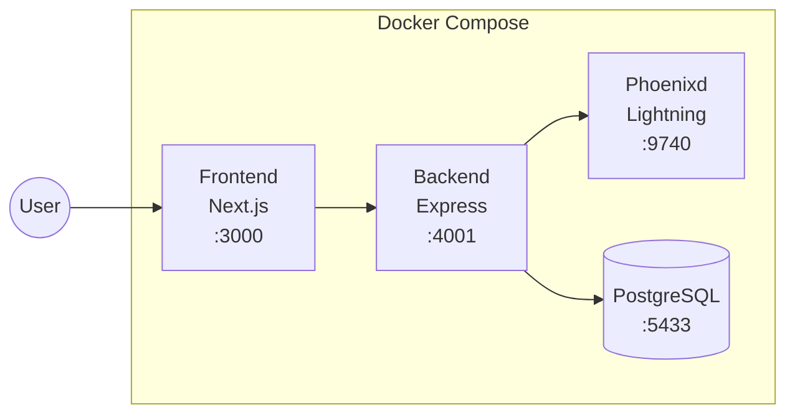

# Installation Guide

## Prerequisites

- [Docker](https://docs.docker.com/get-docker/) and Docker Compose
- Node.js 20+ (for local development only)

---

## Quick Start with Docker

```bash
# Clone the repository
git clone https://github.com/MiguelMedeiros/phoenixd-dashboard
cd phoenixd-dashboard

# Run the setup script (recommended for first time)
./scripts/setup.sh

# Open the dashboard
open http://localhost:3000
```

The setup script will:

- Create the data directory with proper permissions
- Start all Docker services
- Wait for phoenixd to initialize
- Automatically sync the generated password
- Restart the backend with the correct configuration

---

## Manual Start

If you've already run setup once:

```bash
docker compose up -d
```

---

## Troubleshooting

### "Failed to Fetch" or Backend Unhealthy

If the frontend loads but shows "Failed to fetch" errors, the issue is usually that the **frontend can't reach the backend API**.

**Symptoms:**
- Dashboard UI loads but shows errors
- `docker ps` shows backend as "unhealthy"
- Backend logs show successful startup

**Cause:** The frontend is trying to connect to `localhost:4001`, but you're accessing from a different machine.

**Solution 1: Automatic Detection (v1.x+)**

The dashboard now auto-detects the correct API URL based on how you access it. If you're running an older version, update to the latest:

```bash
git pull
docker compose down
docker compose build --no-cache
docker compose up -d
```

**Solution 2: Manual Configuration**

If auto-detection doesn't work, set the API URLs in your `.env` file:

```bash
# Replace with your server's IP or hostname
NEXT_PUBLIC_API_URL=http://192.168.1.100:4001
NEXT_PUBLIC_WS_URL=ws://192.168.1.100:4001
```

Then rebuild the frontend:

```bash
docker compose down
docker compose build frontend --no-cache
docker compose up -d
```

**Solution 3: Use Tailscale (Recommended for Remote Access)**

Tailscale provides automatic URL detection and secure remote access:

1. Go to Settings > Tailscale in the dashboard
2. Add your Tailscale auth key
3. Enable Tailscale
4. Access via `https://phoenixd-dashboard.your-tailnet.ts.net:3000`

---

### Permission Denied Errors

If you encounter a permission error like:

```
Failed to open /phoenix/.phoenix/phoenix.conf with Permission denied
```

Run the following commands:

```bash
# Stop the containers
docker compose down

# Fix permissions (recommended - secure)
sudo chown 1000:1000 ./data/phoenixd
chmod 700 ./data/phoenixd

# Run setup again
./scripts/setup.sh
```

**Alternative solutions:**

```bash
# If you can't use sudo, use group-writable permissions
chmod 770 ./data/phoenixd

# Or remove the data directory and start fresh
rm -rf ./data/phoenixd
./scripts/setup.sh
```

> ⚠️ **Security Note**: Avoid using `chmod 777` as it allows any user on the system to read/write sensitive wallet data including your seed phrase.

---

### Authentication Errors (401 Unauthorized)

If the backend returns 401 errors when trying to connect to phoenixd, the issue is usually a missing or incorrect `PHOENIXD_PASSWORD`.

**How authentication works:**

The backend communicates with **phoenixd** using **HTTP Basic Authentication**. The API password is **automatically generated by phoenixd** on first startup and stored in:

```text
data/phoenixd/phoenix.conf
```

Example content:

```text
http-password=xxxxxxxxxxxxxxxx
```

> ✅ **Note**: If you use `./scripts/setup.sh`, the password is automatically synced to your `.env` file. You only need to configure this manually if you run `docker compose up` directly without running the setup script first.

**Manual configuration:**

If you need to set the password manually, copy the `http-password` value from `phoenix.conf` to your `.env` file:

```text
PHOENIXD_PASSWORD=xxxxxxxxxxxxxxxx
```

Then restart the backend:

```bash
docker compose restart backend
```

---

## Local Development

### Backend

```bash
cd backend
npm install
npx prisma generate
npx prisma db push
npm run dev
```

### Frontend

```bash
cd frontend
npm install
npm run dev
```

---

## Architecture



| Service        | Description                       | Port |
| -------------- | --------------------------------- | ---- |
| **Frontend**   | Next.js 15 + React 19 + shadcn/ui | 3000 |
| **Backend**    | Express + TypeScript + Prisma     | 4001 |
| **Phoenixd**   | ACINQ Lightning Node              | 9740 |
| **PostgreSQL** | Payment history cache             | 5433 |
| **Tailscale**  | VPN for remote access (optional)  | -    |
| **Tor**        | Hidden service (optional)         | -    |

---

## Next Steps

- [Configuration](configuration.md) - Environment variables and network settings
- [PWA Install](pwa-install.md) - Install as mobile app
- [Remote Access](mobile-wallet-setup.md) - Access from anywhere with Tailscale
