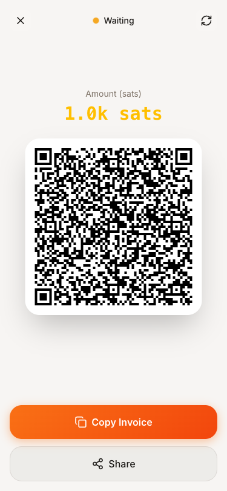
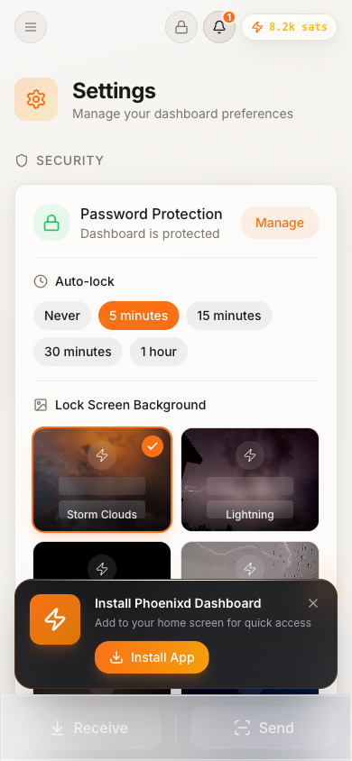
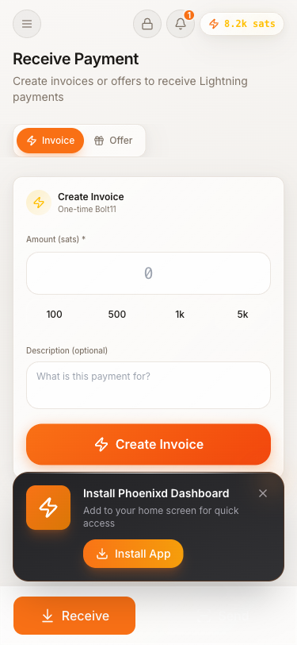
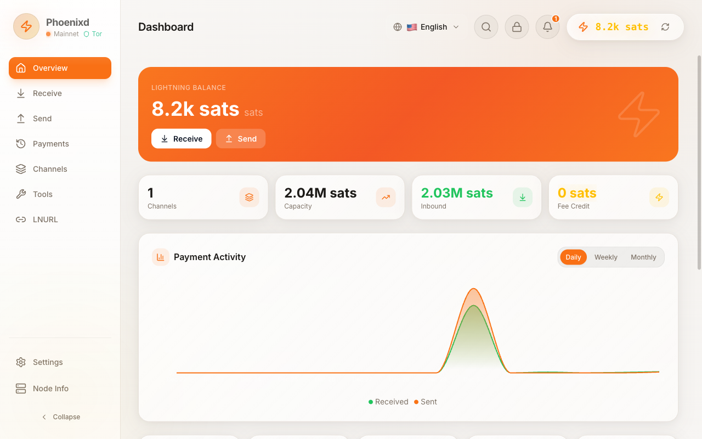

# 📱 Self-Hosted Mobile Lightning Wallet

Transform your Phoenixd Dashboard into a **fully self-hosted mobile Lightning wallet** - no App Store, no Google Play, no third parties. Just your server, your phone, and the Lightning Network.

<p align="center">
  
  
</p>

<p align="center">
  <em>Your self-hosted Lightning wallet - looks and feels like a native app!</em>
</p>

## Why This Setup?

| Traditional Wallet | Self-Hosted PWA |
|-------------------|-----------------|
| Trust app store | You control the code |
| Updates pushed by others | Updates from your server |
| App can be removed/banned | Can't be censored |
| Keys may be on their servers | Keys on YOUR hardware |
| Requires internet registration | Works on your private network |

---

## Architecture Overview

```
┌─────────────────────────────────────────────────────────────────┐
│                        Your Home/Server                          │
│  ┌─────────────┐   ┌─────────────┐   ┌─────────────────────────┐│
│  │  Phoenixd   │───│   Backend   │───│       Frontend          ││
│  │  Lightning  │   │   Express   │   │   Next.js (PWA)         ││
│  │    Node     │   │   :4001     │   │       :3000             ││
│  └─────────────┘   └─────────────┘   └─────────────────────────┘│
│                            │                    │                │
│                    ┌───────┴────────────────────┴───────┐       │
│                    │          Tailscale Container        │       │
│                    │    Magic DNS: your-node.ts.net      │       │
│                    └────────────────┬────────────────────┘       │
└─────────────────────────────────────┼───────────────────────────┘
                                      │
                         Encrypted Tailscale Tunnel
                                      │
                    ┌─────────────────┴─────────────────┐
                    │       Your Phone (Anywhere)        │
                    │  ┌─────────────────────────────┐  │
                    │  │   Tailscale App (VPN)       │  │
                    │  └──────────────┬──────────────┘  │
                    │                 │                  │
                    │  ┌──────────────┴──────────────┐  │
                    │  │   Phoenixd Dashboard PWA    │  │
                    │  │   (Installed as Native App) │  │
                    │  └─────────────────────────────┘  │
                    └───────────────────────────────────┘
```

---

## Step-by-Step Setup

### 1. Set Up Your Server

First, get your Phoenixd Dashboard running on a server (home server, VPS, NAS, Raspberry Pi, etc.):

```bash
git clone https://github.com/MiguelMedeiros/phoenixd-dashboard
cd phoenixd-dashboard
./scripts/setup.sh
```

Verify it's working at `http://localhost:3000`

### 2. Create a Tailscale Account

1. Go to [tailscale.com](https://tailscale.com/) and sign up (free for personal use)
2. You don't need to install anything on your server yet - we'll use Docker

### 3. Generate an Auth Key

1. Go to [Tailscale Admin Console → Settings → Keys](https://login.tailscale.com/admin/settings/keys)
2. Click **"Generate auth key"**
3. Configure the key:
   - **Reusable**: Yes (recommended for servers)
   - **Expiration**: 90 days or "No expiry"
   - **Tags**: Optional (e.g., `tag:server`)
4. Click **"Generate key"**
5. **Copy the key** - it starts with `tskey-auth-`

> ⚠️ **Save this key securely!** You won't be able to see it again.

### 4. Enable Tailscale in Dashboard

1. Open your dashboard at `http://localhost:3000`
2. Go to **Settings** page
3. Scroll to **Remote Access** section
4. Enter your **Auth Key** and optionally customize the **Hostname**
5. Click **"Save"**
6. Click **"Enable"**

<p align="center">
  
</p>

<p align="center">
  <em>The Remote Access section in Settings - enter your Tailscale auth key here</em>
</p>

Wait 30-60 seconds for Tailscale to connect. Once healthy, you'll see:
- ✅ Green status indicator
- 🔗 Magic DNS URL (e.g., `https://phoenixd-dashboard.your-tailnet.ts.net`)
- 📱 QR code for easy mobile access

### 5. Install Tailscale on Your Phone

**iOS:**
1. Download [Tailscale](https://apps.apple.com/app/tailscale/id1470499037) from App Store
2. Open the app and sign in with the same account

**Android:**
1. Download [Tailscale](https://play.google.com/store/apps/details?id=com.tailscale.ipn) from Play Store
2. Open the app and sign in with the same account

### 6. Access Your Dashboard

With Tailscale connected on your phone:

1. **Scan the QR code** from Settings, OR
2. Open the Magic DNS URL in your browser (e.g., `https://phoenixd-dashboard.your-tailnet.ts.net`)

You should see your dashboard with full functionality!

### 7. Install as PWA (The Magic Part! ✨)

<p align="center">
  
</p>

<p align="center">
  <em>The Receive page on mobile - ready to create invoices</em>
</p>

Now install it as a native app:

**iOS (Safari):**
1. Open your Magic DNS URL in **Safari** (not Chrome)
2. Tap the **Share** button (square with arrow)
3. Scroll down and tap **"Add to Home Screen"**
4. Name it "Lightning Wallet" or whatever you prefer
5. Tap **"Add"**

**Android (Chrome):**
1. Open your Magic DNS URL in **Chrome**
2. Tap the **menu** (three dots)
3. Tap **"Install app"** or **"Add to Home Screen"**
4. Confirm the installation

### 8. Done! 🎉

You now have a **native-looking Lightning wallet app** on your home screen that:

- ✅ Opens in full-screen mode (no browser UI)
- ✅ Works from anywhere in the world
- ✅ Connects securely to YOUR node
- ✅ Receives real-time payment notifications
- ✅ Is completely self-hosted

---

## Usage Tips

### Receiving Payments on the Go

1. Open your PWA
2. Go to **Receive** tab
3. Create an invoice with amount and description
4. Show the QR code to the payer
5. Get a notification when payment arrives!

### Sending Payments

1. Open your PWA
2. Go to **Send** tab
3. Paste an invoice or scan a QR code
4. Confirm and pay

### Checking Balance

Your dashboard home screen shows:
- Current balance (on-chain + Lightning)
- Recent payment activity
- Channel status

---

## Troubleshooting

### "Connection refused" or timeout

1. Make sure Tailscale is **connected** on your phone (check the Tailscale app)
2. Verify Tailscale is **healthy** in Dashboard Settings
3. Try refreshing the DNS name in Settings

### PWA not installing

- **iOS**: Must use **Safari** (Chrome/Firefox don't support PWA install on iOS)
- **Android**: Must use **Chrome** (Firefox doesn't support PWA install well)
- Make sure you're accessing via HTTPS (Magic DNS URLs are HTTPS)

### Slow loading

First load may take a few seconds. Subsequent loads are faster due to:
- Service Worker caching
- PWA asset caching

### Can't see QR code

- Make sure Tailscale is enabled AND healthy (green status)
- Try clicking "Refresh DNS" button
- Check container logs: `docker logs phoenixd-tailscale`

---

## Security Considerations

### What's Protected

| Layer | Protection |
|-------|-----------|
| **Network** | Tailscale encrypts all traffic end-to-end |
| **Access** | Only your Tailscale devices can reach the dashboard |
| **Auth** | Dashboard password protects against unauthorized access |
| **Keys** | Your Lightning keys never leave your server |

### Best Practices

1. **Set a strong dashboard password** in Settings → Security
2. **Enable auto-lock** to require password after inactivity
3. **Keep your Tailscale account secure** with strong password/2FA
4. **Backup your seed phrase** - store it offline, never digitally
5. **Revoke auth keys** you no longer use in Tailscale admin

### If Your Phone is Lost/Stolen

1. **Remove the device** from Tailscale admin console immediately
2. The thief cannot access your dashboard without Tailscale
3. Your funds are safe - they can't spend without dashboard access
4. Consider changing your dashboard password

---

## Advanced: Multiple Devices

You can install the PWA on multiple devices:

1. **Tablets** - Great for a home "Bitcoin terminal"
2. **Family members** - Share access with trusted people
3. **Desktop browsers** - Chrome/Edge support PWA install

Each device needs:
1. Tailscale installed and logged in
2. PWA installed from the Magic DNS URL

---

## Comparison with Other Solutions

| Feature | Phoenix Mobile | BlueWallet + LNDHub | This Setup |
|---------|---------------|---------------------|------------|
| Self-hosted | ❌ | ⚠️ Partial | ✅ Full |
| No app store | ❌ | ❌ | ✅ |
| Node control | ❌ | ⚠️ Separate | ✅ Same node |
| Remote access | ✅ Built-in | ⚠️ Complex | ✅ Easy |
| Channel management | ❌ | ⚠️ Limited | ✅ Full |
| Payment history | ✅ | ⚠️ Limited | ✅ Full export |
| Open source | ✅ | ✅ | ✅ |

---

## FAQ

**Q: Is this as good as a native app?**
A: For most use cases, yes! PWAs can do almost everything native apps can, except for some hardware features like NFC.

**Q: Can I use this without Tailscale?**
A: Yes, but you'd need to set up port forwarding, dynamic DNS, and TLS certificates manually. Tailscale makes it much easier.

**Q: What if Tailscale goes down?**
A: Your node keeps running. You just can't access it remotely until Tailscale is back. You can always access locally.

**Q: Can I share access with family?**
A: Yes! Add their devices to your Tailscale network and have them install the PWA.

**Q: Is there a cost?**
A: Tailscale is free for personal use (up to 100 devices). Your only cost is running your server.

---

## Summary

<p align="center">
  
</p>

<p align="center">
  <em>The full dashboard on desktop - same experience as your mobile PWA</em>
</p>

You've created a **sovereign mobile Lightning wallet**:

- 🏠 **Self-hosted** - Runs on YOUR hardware
- 🔐 **Private** - Only YOUR devices can access it
- 📱 **Mobile** - Install as app on any phone
- 🌍 **Global** - Access from anywhere in the world
- ⚡ **Lightning** - Fast, cheap Bitcoin payments
- 🚫 **No intermediaries** - No app stores, no third parties

**Welcome to sovereign Bitcoin! ⚡**
