# 🧅 Tor Hidden Service

Access your Phoenixd Dashboard privately through the Tor network using a `.onion` address. This provides **maximum privacy** for accessing your node from anywhere in the world.

<p align="center">
  <strong>No IP exposure • Anonymous access • Censorship resistant</strong>
</p>

## Why Use Tor Hidden Service?

| Feature          | Regular Internet  | Tor Hidden Service   |
| ---------------- | ----------------- | -------------------- |
| IP Privacy       | ❌ Exposed        | ✅ Hidden            |
| Censorship       | ⚠️ Can be blocked | ✅ Resistant         |
| Requires account | Depends           | ✅ No account needed |
| Speed            | ✅ Fast           | ⚠️ Slower            |
| Anonymity        | ❌ Trackable      | ✅ Anonymous         |

**Best for:**

- Maximum privacy access
- Censorship-resistant environments
- Users who prioritize anonymity over speed

---

## How It Works

```mermaid
flowchart TB
    subgraph server["🏠 Your Server"]
        direction LR
        phoenixd["⚡ Phoenixd<br/>Lightning Node"]
        backend["🔧 Backend<br/>:4000"]
        frontend["🌐 Frontend<br/>:3000"]
        tor["🧅 Tor<br/>Hidden Service"]
        phoenixd --> backend --> frontend
        frontend --> tor
        backend --> tor
    end

    subgraph tornet["🌐 Tor Network"]
        relay1["🔀 Relay"]
        relay2["🔀 Relay"]
        relay3["🔀 Relay"]
    end

    subgraph user["📱 Tor Browser (Anywhere)"]
        browser["🧅 Tor Browser"]
    end

    tor -->|".onion address"| tornet
    tornet <-->|"🔒 Encrypted"| user

    style server fill:#1a1a2e,stroke:#16213e,color:#fff
    style tornet fill:#7b1fa2,stroke:#4a148c,color:#fff
    style user fill:#1a1a2e,stroke:#16213e,color:#fff
    style phoenixd fill:#f59e0b,stroke:#d97706,color:#000
    style backend fill:#3b82f6,stroke:#2563eb,color:#fff
    style frontend fill:#10b981,stroke:#059669,color:#fff
    style tor fill:#7b1fa2,stroke:#4a148c,color:#fff
    style browser fill:#7b1fa2,stroke:#4a148c,color:#fff
```



---

## Setup Guide

### 1. Start Your Dashboard

Make sure your Phoenixd Dashboard is running:

```bash
cd phoenixd-dashboard
docker compose up -d
```

### 2. Enable Tor in Settings

1. Open your dashboard at `http://localhost:3000`
2. Go to **Settings** page
3. Scroll to the **Privacy** section
4. Click **"Enable"** next to Tor

The system will:

- Pull the Tor Docker image (first time only)
- Start the Tor container
- Generate your unique `.onion` address
- Configure the Hidden Service automatically

### 3. Wait for Initialization

The first time you enable Tor, it may take **1-2 minutes** to:

- Download the Tor image
- Generate cryptographic keys
- Connect to the Tor network
- Publish your Hidden Service

You'll see a **green status indicator** when ready.

### 4. Get Your .onion Address

Once Tor is healthy:

- Your `.onion` address appears in the Settings page
- Use the **copy button** to copy the address
- Scan the **QR code** for mobile access

Example address:

```
http://mp4y327smfb4wgahghrgtiuzotdfyk6bljutaova3x7hlzj3pb4x5pad.onion
```

---

## Accessing via Tor Browser

### Desktop

1. Download [Tor Browser](https://www.torproject.org/download/)
2. Install and open it
3. Paste your `.onion` address in the URL bar
4. Your dashboard loads privately!

### Mobile (Android)

1. Install [Tor Browser for Android](https://play.google.com/store/apps/details?id=org.torproject.torbrowser)
2. Open the app
3. Paste or scan your `.onion` address
4. Access your dashboard anonymously

### Mobile (iOS)

1. Install [Onion Browser](https://apps.apple.com/app/onion-browser/id519296448)
2. Open the app
3. Enter your `.onion` address
4. Access your dashboard

---

## Features

### ✅ Full Dashboard Access

Everything works over Tor:

- Send & receive Lightning payments
- Create and pay invoices
- View payment history
- Manage channels
- Access all tools

### ✅ Real-time Updates

WebSocket connections work over Tor for:

- Live balance updates
- Payment notifications
- Log streaming

### ✅ Persistent Address

Your `.onion` address stays the same even after restarts. The cryptographic keys are stored in a Docker volume.

---

## Security Considerations

### What's Protected

| Layer          | Protection                                    |
| -------------- | --------------------------------------------- |
| **IP Address** | Your server IP is never exposed               |
| **Network**    | All traffic is encrypted through Tor relays   |
| **Access**     | Only those with the .onion address can access |
| **Auth**       | Dashboard password still required             |

### Best Practices

1. **Set a strong dashboard password** - The .onion address provides access, but password protects actions
2. **Keep your .onion address private** - Share only with trusted parties
3. **Enable auto-lock** - Protect against unauthorized access
4. **Backup your seed phrase** - Always have offline backups

### Understanding the Trade-offs

| Advantage            | Trade-off                       |
| -------------------- | ------------------------------- |
| Maximum privacy      | Slower than direct connection   |
| No IP exposure       | Requires Tor Browser            |
| Censorship resistant | ~3-10 second page loads         |
| Anonymous            | May be flagged by some services |

---

## Troubleshooting

### Tor Container Won't Start

```bash
# Check container status
docker ps -a | grep tor

# View logs
docker logs phoenixd-tor
```

### .onion Address Not Appearing

The address may take 1-2 minutes to generate on first start. If it doesn't appear:

```bash
# Check if the hostname file exists
docker exec phoenixd-backend cat /tor-data/hidden_service/hostname
```

### Slow Page Loads

This is normal for Tor. Expect:

- First load: 5-15 seconds
- Subsequent loads: 3-10 seconds
- Real-time updates may have slight delays

### Connection Timeouts

Tor connections can be unstable. Try:

1. Refresh the page
2. Wait a moment and try again
3. Check Tor Browser's circuit (click 🧅 icon)

### WebSocket Disconnections

If you see WebSocket errors:

1. The connection will auto-reconnect
2. Real-time updates may have delays
3. Page refresh if issues persist

---

## Comparison: Remote Access Methods

| Feature       | Tailscale                  | Cloudflare Tunnel          | Tor Hidden Service |
| ------------- | -------------------------- | -------------------------- | ------------------ |
| **Privacy**   | ⚠️ Tailscale sees metadata | ⚠️ Cloudflare sees traffic | ✅ Maximum         |
| **Speed**     | ✅ Fast                    | ✅ Fast                    | ⚠️ Slow            |
| **Setup**     | Easy                       | Medium                     | Easy               |
| **Account**   | Required                   | Required                   | None               |
| **Cost**      | Free tier                  | Free tier                  | Free               |
| **Mobile**    | App required               | Browser                    | Tor Browser        |
| **IP Hidden** | ✅ From internet           | ✅ From internet           | ✅ Fully           |

**Choose Tor when:**

- Privacy is your top priority
- You don't want to create accounts
- You need censorship resistance
- You can accept slower speeds

---

## Technical Details

### Docker Configuration

The Tor container is managed automatically. Configuration file:

```
# services/tor/torrc
HiddenServiceDir /var/lib/tor/hidden_service/
HiddenServicePort 80 phoenixd-frontend:3000
HiddenServicePort 4000 phoenixd-backend:4000
```

### Ports Exposed

- **Port 80** → Frontend (your dashboard UI)
- **Port 4000** → Backend API

### Data Persistence

Hidden Service keys are stored in the `tor_data` Docker volume:

- Keys persist across restarts
- Your .onion address remains the same
- Volume is automatically managed

---

## FAQ

**Q: Is Tor legal?**
A: Yes, in most countries. Tor is legal technology used by journalists, activists, and privacy-conscious users worldwide.

**Q: Can I use Tor and Tailscale together?**
A: Yes! Enable both for different use cases. Use Tailscale for fast access, Tor for private access.

**Q: Will my ISP know I'm using Tor?**
A: Your ISP can see you're connected to Tor, but not what you're doing. For ISP privacy, use Tor bridges.

**Q: Can someone find my server from the .onion address?**
A: No. The mathematical design of Tor Hidden Services makes it computationally infeasible to discover the server's real IP.

**Q: What if I lose my .onion address?**
A: Find it in Settings, or run: `docker exec phoenixd-backend cat /tor-data/hidden_service/hostname`

**Q: Can I use a custom .onion address?**
A: Yes, but it requires generating "vanity" addresses which is computationally expensive. Not currently supported in the UI.

---

## Summary

You now have a **private, anonymous way** to access your Lightning node:

- 🧅 **Anonymous** - No IP exposure whatsoever
- 🔒 **Encrypted** - End-to-end through Tor relays
- 🌍 **Global** - Access from anywhere
- 🚫 **No accounts** - No third-party registration
- ⚡ **Full featured** - Complete dashboard access

**Welcome to sovereign, private Bitcoin! 🧅⚡**
